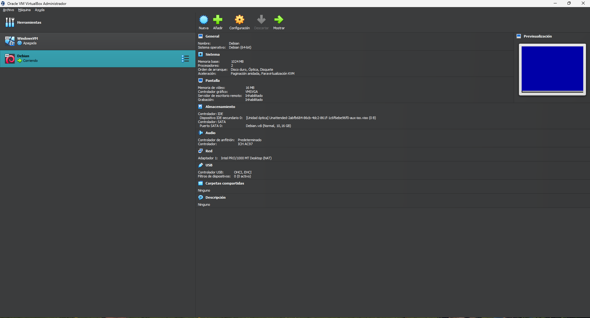
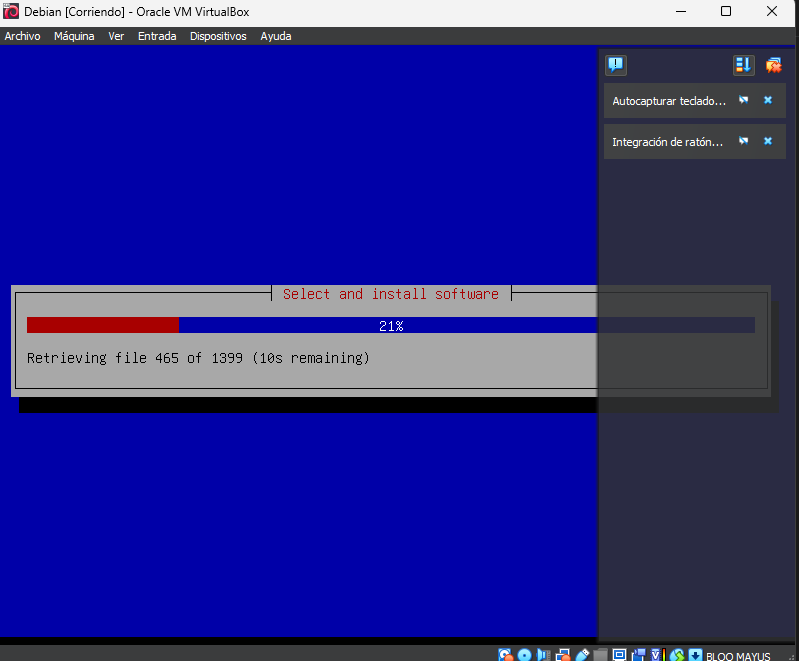
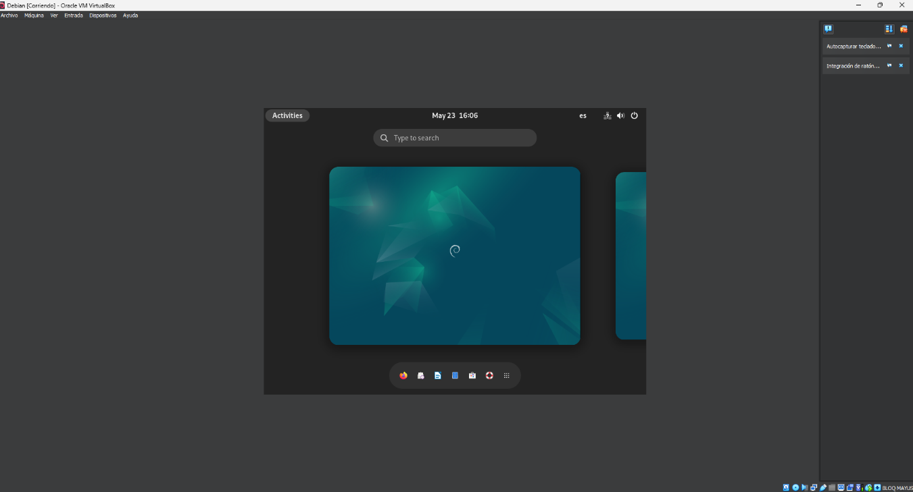

# Informe sobre la instalación del sistema operativo Debian
**Curso:** Sistemas operativos I
**Estudiante:** Harold Sneider pulido Rios

# Instalación de Debian en una Máquina Virtual
---
## Tabla de Contenido

- [Requisitos](#requisitos)
  - [Requisitos de la Máquina Virtual](#requisitos-de-la-máquina-virtual)
  - [Requisitos de Debian](#requisitos-de-debian)
- [Pasos para la Instalación](#pasos-para-la-instalación)
  - [1. Descargar la Imagen ISO de Debian](#1-descargar-la-imagen-iso-de-debian)
  - [2. Crear una Nueva Máquina Virtual](#2-crear-una-nueva-máquina-virtual)
  - [3. Configurar la Máquina Virtual](#3-configurar-la-máquina-virtual)
  - [4. Iniciar la Máquina Virtual e Instalar Debian](#4-iniciar-la-máquina-virtual-e-instalar-debian)
  - [5. Post-Instalación](#5-post-instalación)
- [Recursos Adicionales](#recursos-adicionales)

  ---
  ## Requisitos

### Requisitos de la Máquina Virtual

2. **Recursos del Sistema:**
   - **CPU:** Procesador con soporte para virtualización (Intel VT-x o AMD-V)
   - **RAM:** Mínimo 1 GB (se recomienda 2GB o más)
   - **Disco Duro:** Mínimo 10GB de espacio libre (se recomiendael 20GB o más)
   - **Conexión a Internet:** Para descargar Debian y actualizaciones
  
   ### Requisitos de Debian

1. **Imagen ISO de Debian:**
   - Descarga la última versión de Debian desde [aquí](https://www.debian.org/distrib/).

2. **Requisitos del Sistema:**
   - **CPU:** Procesador con arquitectura x86_64 (64-bit)
   - **RAM:** Mínimo 512 MB (se recomienda 2 GB o más)
   - **Disco Duro:** Mínimo 10 GB de espacio libre (se recomienda 20 GB o más)
   - **Red:** Tarjeta de red compatible
## Pasos para la Instalación

### 1. Descargar la Imagen ISO de Debian

- Ve al sitio oficial de Debian y descarga la imagen ISO de la última versión estable de Debian.

### 2. Crear una Nueva Máquina Virtual

- Abre tu software de virtualización.
- Crea una nueva máquina virtual y selecciona la imagen ISO de Debian como el medio de instalación.
- Configura los recursos de la máquina virtual (CPU, RAM, disco duro) según los requisitos mencionados.

### 3. Configurar la Máquina Virtual

- **Nombre:** Asigna un nombre a tu máquina virtual.
- **Tipo de Sistema Operativo:** Selecciona Linux y la versión correspondiente a Debian.
- **Memoria:** Asigna al menos 1 GB de RAM (se recomiendan 2 GB).
- **Disco Duro:** Crea un disco duro virtual de al menos 10 GB (se recomiendan 20 GB).

  

  

### 4. Iniciar la Máquina Virtual e Instalar Debian

  

- Inicia la máquina virtual.
- Sigue las instrucciones en pantalla para instalar Debian.
  - Selecciona el idioma y la región.
  - Configura la red (puede ser necesario seleccionar `DHCP`)
  - Configura el gestor de arranque GRUB.
  - Completa la instalación y reinicia la máquina virtual.

 

  

### 7. Conclusión

#### Resumen del proceso
Este informe detalla los pasos para instalar Debian en un entorno VirtualBox, desde la configuración inicial hasta la configuración.
#### Observaciones y desafíos
- Proceso de instalación sin ningun problema, con ajustes menores necesarios para un rendimiento óptimo.
- Posibles problemas de compatibilidad de hardware que se resolvieron mediante actualizaciones del sistema.
#### Comentarios Sobre Debian
Un sistema operativo bastante facil de instalar, y a la vez muy funcional.
>[!NOTE]
Fue uno de los sistemas operativos mas faciles de instalar por el conocimiento que se aprendio por las anteriores practicas.
>### 8. Referencias

#### Sitios Web

- [ChatGPT - OpenAI](https://chatgpt.com/)
- [Debian](https://www.debian.org/distrib/index.es.html)
  
