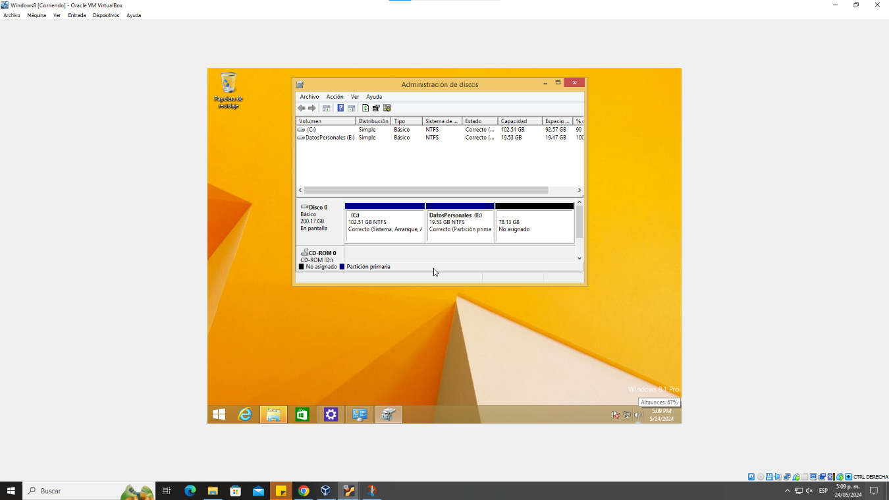
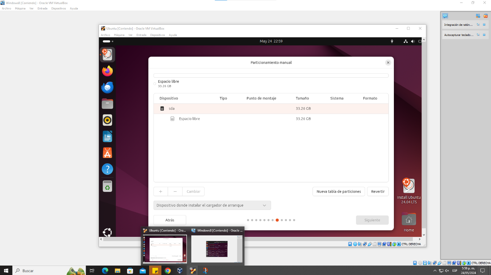
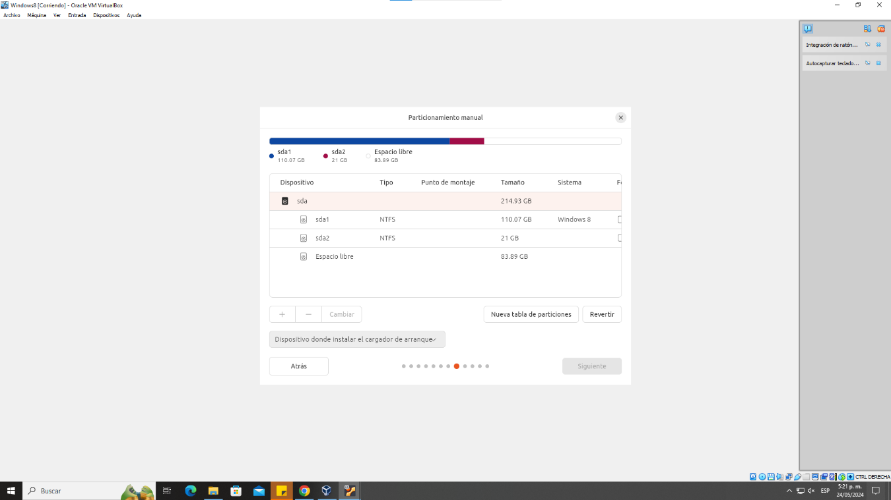
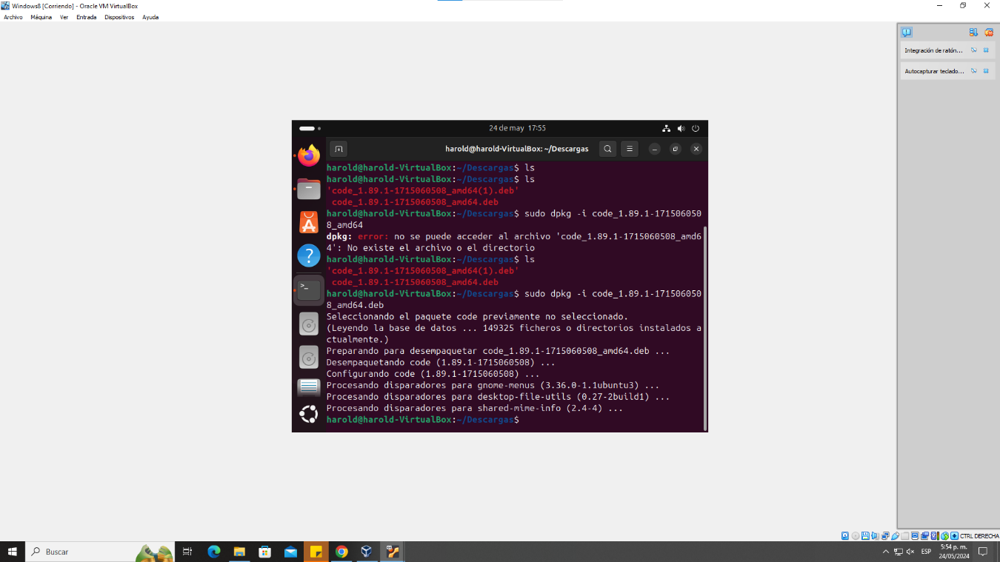

# Informe sobre la instalación del sistema operativo Windows 8 en una maquina virtual y Ubuntu
**Curso:** Sistemas operativos I
**Estudiante:** Harold Sneider pulido Rios

---

## Tabla de Contenido

  - [Informe Sobre la Instalación del Sistema Operativo Windows 8 en una Máquina Virtual](#informe-sobre-la-instalación-del-sistema-operativo-Windows-8-en-una-máquina-virtual)
  - [Tabla de Contenido](#tabla-de-contenido)
    - [1. Introducción](#1-introducción)
      - [Propósito](#propósito)
      - [Alcance](#alcance)
    - [2. Requisitos Previos a la Instalación](#2-requisitos-previos-a-la-instalación)
      - [Requisitos de hardware](#requisitos-de-hardware)
      - [Requisitos de software](#requisitos-de-software)
    - [3. Configuración de la Máquina Virtual (MV)](#3-configuración-de-la-máquina-virtual-mv)
      - [Elección del software de virtualización](#elección-del-software-de-virtualización)
      - [Creación de la máquina virtual](#creación-de-la-máquina-virtual)
    - [4. Proceso de Instalación de Windows 8](#4-proceso-de-instalación-de-Windows-8)
      - [Descarga de la ISO de Windows 8](#descarga-de-la-iso-de-Windows-8)
      - [Configuración de la máquina virtual](#configuración-de-la-máquina-virtual)
      - [Pasos de la instalación](#pasos-de-la-instalación)
    - [5. Configuración para abrir ubuntu desde Windows 8 ](#5-configuración-para-abrir-ubuntu-desde-windows-8)
  - [6. Pruebas y verificación](#6-pruebas-y-verificación)
      - [Pruebas de funcionalidad](#pruebas-de-funcionalidad)
    - [7. Conclusión](#7-conclusión)
      - [Resumen del proceso](#resumen-del-proceso)
      - [Observaciones y desafíos](#observaciones-y-desafíos)
      - [Comentarios Sobre Windows 8](#comentarios-sobre-Windows-8)
    - [8. Referencias](#8-referencias)
      - [Sitios Web](#sitios-web)

     ---

    ### 1. Introducción

#### Propósito
El proposito de este informe es llevar un registro y una guia de la instalación de Windows 8, desde la configuración en la maquina virtual, los requistos necesarios para correrlos y unas pruebas para ver que cosas puede hacer este sistema operativo.
#### Alcance
Su alcance va hasta que se le logre la correcta instalación y configuración de Windows 8 desde Virtual Box.

### 2. Requisitos Previos a la Instalación

#### Requisitos de hardware
- Procesador: Procesador de dos núcleos o superior (se recomiendan 2 GHz)
- MEMORIA RAM: Mínimo 2 GB (se recomiendan 4 GB)
- Espacio en disco: Al menos 20 GB de almacenamiento libre (se recomiendan el doble o triple)
- Conexión a Internet: Para descargar software y actualizaciones.
- Arquitectura: 64-bits.

#### Requisitos de software
- Software de virtualización: Oracle VirtualBox (versión 6.1 o posterior)
- Archivo ISO de Windows 8: Windows 8.1

### 3. Configuración de la Máquina Virtual (MV)

#### Elección del software de virtualización
Para esta instalación, se elige Oracle VirtualBox debido a su amplio soporte y facilidad de uso.

#### Creación de la máquina virtual
1. **Abre VirtualBox** y haz clic en «Nuevo» para crear una nueva máquina virtual.
2. **Nombra la VM** (Windows 8.1), establece el tipo en «Microsoft Windows» y la versión en «Windowws 8 (64 bits)».
3. **Asigne memoria**: Asigna al menos 4 GB de memoria RAM.
4. **Crear un disco duro virtual**: Seleccione «Crear un disco duro virtual ahora» y siga las instrucciones para asignar al menos 25 GB de almacenamiento.
   

  

### 4. Proceso de Instalación de Windows 8

#### Descarga de la ISO de Windows
- Descargue el archivo ISO de Windows 8.1 desde el sitio web oficial de Microsoft, [Windows 8.1 (https://learn.microsoft.com/es-es/lifecycle/products/windows-8).
#### Configuración de la máquina virtual
1. **Montar la ISO**: Vaya a la configuración de la VM, en «Almacenamiento», conecte la ISO de Windows descargada al controlador IDE.
2. **Configuración de red**: Asegúrese de que el adaptador de red está configurado en «NAT» para el acceso a Internet durante la instalación.

#### Pasos de la instalación
1. **Arrancar la máquina virtual**: Haga clic en «Inicio» para arrancar desde la ISO.
2. **Seleccionar Instalar Windows**: Sigue las instrucciones en pantalla.
3. **La maquina se reiniciara**: Cuando la maquina se reinicie le pedira los datos de ingreso.
4. **Acceda al administrador de discos**: Haga click derecho sobre el cuadro de windows y seleccione administración de discos.
5. **particiones**: Seleccione espacio no asignado y creo una nueva llamada "Datos personales" y ponga de capacidad 19.53 GB, de finalizar y ya tendria el disco particionado.
6. **Completar instalación**: Haga clic en «Instalar ahora» y espere a que se complete el proceso. Una vez hecho esto, reinicie la máquina virtual.
   

  

### 5. Configuración para abrir ubuntu desde Windows 8
1. **Descargue la iso de Ubuntu**: Para poder abrir ubuntu es necesario la descarga de su iso en la pagina oficial[Ubuntu 24.04 LTS(https://ubuntu.com/download/desktop).
2. Cuando haya echo esto dirijase a la parte superior de su maquina virtual y seleccione "Dispositivos" "unidades opticas" y elimine el disco de la unidad virtual.
3. En la interfaz de Virtual Box seleccione "configuración" "Almacenamiento" "Vacio" alli seleccione la iso de ubuntu.
4. Inicie de nuevo la maquina y siga los pasos de instalación.
5. Antes de terminar la instalación sale la opción "Instalacion manual" hacer click y ahi nos lleva a particionar el disco.
6. 6. estando alli realice dos partituras mas con los valores que se muestran a continuación.

  

 

  

### 6. Pruebas y verificación
#### Pruebas de funcionalidad
- Verifique la instalación del software, la conectividad a Internet y la funcionalidad básica del sistema.

 

  

### 7. Conclusión

#### Resumen del proceso
Este informe detalla los pasos para instalar Windows 8 en un entorno VirtualBox, desde la configuración inicial hasta la configuración, las particiones y las pruebas posteriores a la instalación, y la instalación de Ubuntu con sus particiones y una prueba final de funcionamiento.
#### Observaciones y desafíos
- Proceso de instalación con problemas menores, con ajustes menores necesarios para un rendimiento óptimo.
- Posibles problemas de compatibilidad de hardware que se resolvieron mediante actualizaciones del sistema.
#### Comentarios Sobre Windows 8
A pesar de ser un sistema operativo algo viejo se las apaña muy bien, no hay problemas de sensibiliad, corre los diferentes codigos de manera efectiva y permite una satisfactoria instalacion, compatibilidad, configuración con Ubuntu.

>[!NOTE]
Admitiendolo me costo un poco terminar la instalación por algunos problemas tecnicos pero cuando se resolvieron fue muy divertido de usar y explorar sus capacidades.
>### 8. Referencias

#### Sitios Web

- [ChatGPT - OpenAI](https://chatgpt.com/)
- [Ubuntu](https://ubuntu.com/)
- [Windows](https://learn.microsoft.com/es-es/lifecycle/products/windows-8)

